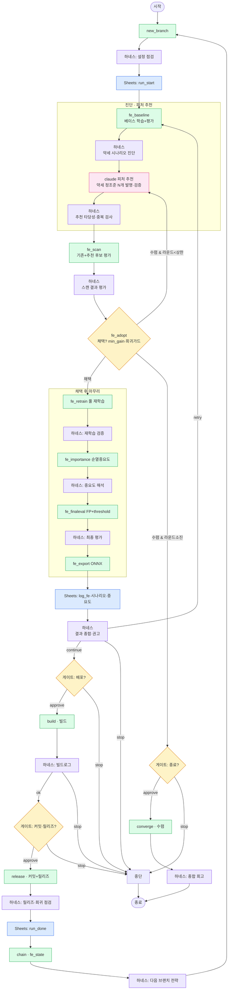

# 파이프라인 구조도 (완전판) — LangGraph

피처 추천 + 노드별 하네스 + FE 분해 + Google Sheets 포함 최종 설계.
렌더 이미지: `pipeline_full.png`.

> **VS Code 미리보기**: 확장 `Markdown Preview Mermaid Support` 설치 → 창 한번 리로드 → `Ctrl+Shift+V`.

구성:
1. **claude 피처 추천 노드**(분홍): 약세 진단 → claude 가 새 후보 피처 발명·검증 → 후보풀 확장.
   수렴(채택0) 시 다른 각도로 재추천 루프(라운드 상한).
2. **노드별 하네스**(보라): 각 compute 노드 뒤 claude 하네스 → 분석·판정(continue/retry/stop).
3. **FE 분해**: 한 subprocess → 베이스/스캔/채택/재학습/중요도/최종평가/export 노드로.
4. **사람 게이트**(노랑): 비가역(배포·커밋) 단계 `interrupt()` 승인.
5. **Sheets**(파랑): `log_sheet(kind)` 팩토리로 DRY 로깅.



- 분홍=claude 피처추천 / 보라=하네스 / 초록=compute / 노랑=게이트·결정 / 파랑=Sheets

---

## 노드 분류 (유지보수 기준)
| 종류 | 예 | 쪼개는 이유 |
|---|---|---|
| **compute** | fe_baseline·scan·retrain·importance·finaleval·export·build·release | 무거움 → 단계별 체크포인트·재시도·crash 재개 |
| **decision** | fe_adopt | 분기점 가시화 |
| **reco** | claude 피처 추천 | 약세 정조준 신규 후보 발명 |
| **harness** | h_* | claude -p 분석·판정 (노드별 on/off) |
| **gate** | g1·g2·gC | 사람 승인(`interrupt`) — 비가역 보호 |
| **log(sheet)** | run_start·fe·scenarios·importance·run_done | `log_sheet` 팩토리 1개로 DRY |

## 피처 추천 노드 계약
| 항목 | 내용 |
|---|---|
| 입력 | 약세 진단(h_baseline) + 시도/채택 피처(중복회피) + 현재 FP1/5/10 |
| 호출 | `claude -p <추천 프롬프트> --output-format json` |
| 출력(JSON) | `[{name, desc, lambda_src, target_scenario}]` |
| 검증 | 더미 시퀀스 `lambda` exec → 통과분만 + dedup |
| 출력 state | 검증 후보 → `state["candidates"]` 병합 → fe_scan 사용 |
| 수렴 루프 | 채택0 & 라운드<상한 → 다른 각도 재추천(실패셋 회피) → scan |

```python
RECO_SCHEMA = {"type":"array","items":{"type":"object","properties":{
  "name":{"type":"string"}, "desc":{"type":"string"},
  "lambda_src":{"type":"string"}, "target_scenario":{"type":"string"}},
  "required":["name","lambda_src"]}}

def n_recommend(state):
    weak  = state["harness"]["baseline"]["evidence"]
    tried = state.get("tried_feats", [])
    raw = subprocess.run(["claude","-p",build_reco_prompt(weak,tried,state["r"]["fe_stats"]),
                          "--output-format","json"], capture_output=True,text=True,timeout=180).stdout
    cands = validate_lambdas(json.loads(raw))            # exec 검증 + dedup
    RT.bot.log(f"🧬 추천 {len(cands)}개: {[c['name'] for c in cands]}", "추천")
    return {"candidates": (state.get("candidates") or []) + cands,
            "tried_feats": tried + [c["name"] for c in cands]}
```

## 하네스 노드 팩토리 + 비용 토글
```python
HARNESS_SCHEMA = {"type":"object","properties":{
  "assessment":{"type":"string"}, "evidence":{"type":"string"},
  "verdict":{"enum":["continue","retry","stop"]}, "reason":{"type":"string"},
  "suggestion":{"type":"string"}}, "required":["assessment","verdict","reason"]}

def claude_harness(stage, ctx_fn):
    def node(state):
        text, extra = ctx_fn(state)
        v = json.loads(subprocess.run(["claude","-p",build_harness_prompt(stage,text,extra),
              "--output-format","json"], capture_output=True,text=True,timeout=120).stdout)
        RT.bot.log(f"🤖 [{stage}] {v['assessment']} → {v['verdict']}: {v['reason']}", stage)
        return {"harness": {**state.get("harness",{}), stage: v}, "decision": v["verdict"]}
    return node

# 비용 제어: 켤 노드만 (가벼운 노드는 OFF/룰베이스)
HARNESS_ON = {"baseline","reco","scan","fe","build"}
def maybe_harness(stage, ctx_fn):
    return claude_harness(stage, ctx_fn) if stage in HARNESS_ON else passthrough
```

## Sheets DRY 팩토리
```python
def log_sheet(kind):   # kind: run_start|fe|scenarios|importance|run_done|converge
    def node(state):
        s, r = RT.sheet, state.get("r", {})
        if   kind=="run_start":  s.log_run_start(state["branch"], RT.args.model, ...)
        elif kind=="fe":         s.log_fe(state["branch"], state["run_num"], "완료", ...)
        elif kind=="scenarios":  s.log_scenarios(state["branch"], RT.args.model, "FP=1%", r["scenario_fp1"])
        elif kind=="importance": s.log_importance(state["branch"], 1, r["importance"], FEATURE_DESCRIPTIONS)
        elif kind=="run_done":   s.log_run_done(state["branch"], RT.args.model, success=True)
        elif kind=="converge":   s.update_run_summary(notes="수렴 완료", ...)
        return {}
    return node
```

## 코드 매핑
| 노드 | 호출 대상 | 비고 |
|---|---|---|
| fe_baseline/scan/retrain/imp/feval/export | `feature_engineer.py` **서브커맨드**(`--step ...`) | 지금은 한 subprocess → 분리 필요 |
| reco | `n_recommend` (claude -p) | invent 재설계판 |
| fe_adopt | orchestrator 판정 | min_gain·overall_tol 회귀가드 |
| h_* | `claude_harness(stage, ctx_fn)` | HARNESS_ON 토글 |
| log_* | `log_sheet(kind)` | DRY 팩토리 |
| g1/g2/gC | `interrupt()` | 기존 `_gate` |

---

## mermaid 빠른 문법
| 쓰기 | 뜻 |
|---|---|
| `A[텍스트]` | 작업 노드 (사각) |
| `B{텍스트}` | 판단/게이트 (마름모) |
| `C([텍스트])` | 시작·종료 (둥근) |
| `A --> B` / `A -->\|라벨\| B` | 무조건 / 조건 엣지 |
| `A -.-> B` | 점선 |
| `C --> A` | 루프 |
| `graph TD` / `LR` | 위→아래 / 좌→우 |
| 특수문자(`:` `?`) 라벨 | `{"게이트: 배포?"}` 따옴표 필수 |
