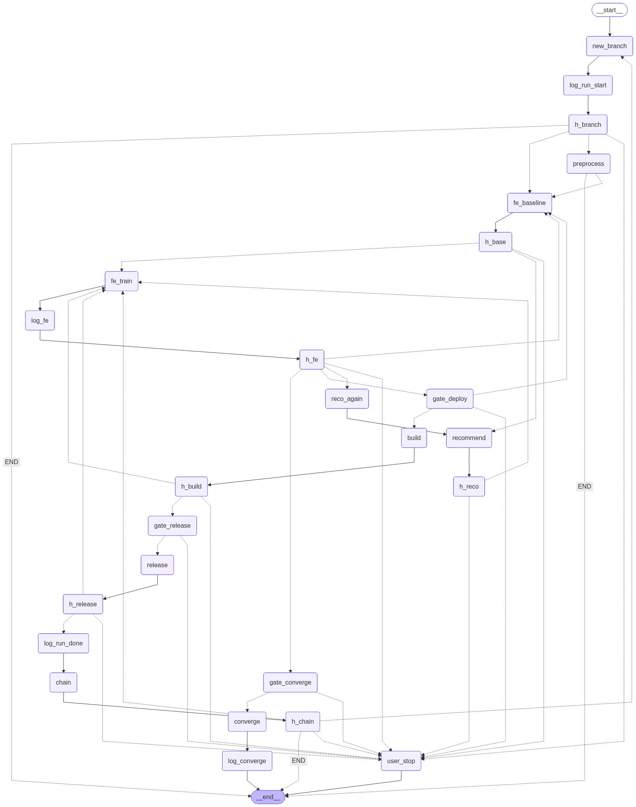
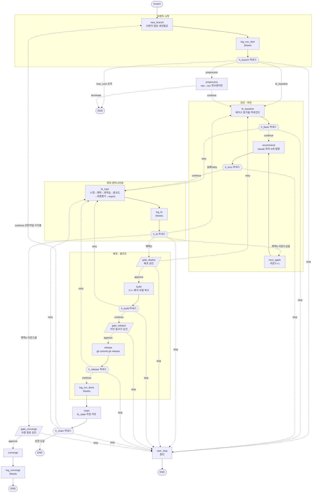
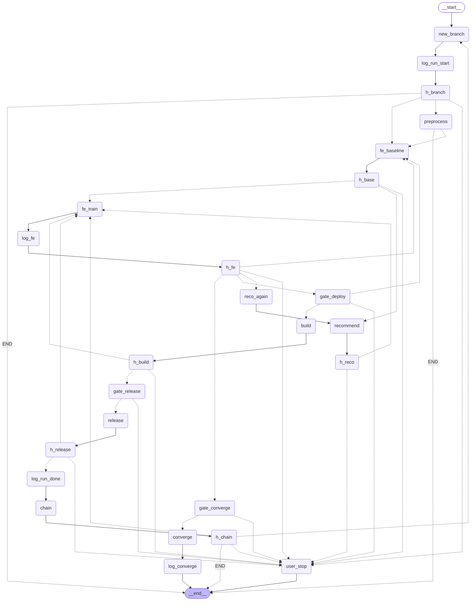

# ML 파이프라인 — LangGraph 구조 문서

`ml/orchestrator.py` 의 LangGraph `StateGraph` 를 노드 단위로 설명한다.
제어흐름은 이 그래프, 무거운 실행 함수는 `ml/pipeline_steps.py` 에 있다.

---

## 1. 큰 그림

- **1 run = 1 git 브랜치 = 피처 1개 채택 시도** (`dcdetect_001`, `_002`, …).
- 채택에 성공하면 **체인**(그래프 사이클)으로 다음 브랜치를 시작하고, 더 이상
  목적점수 이득이 없으면 **수렴**하여 종료한다.
- 각 compute 노드 뒤에는 **하네스**(claude 판정) 노드가 붙어 `continue / retry / stop`
  으로 라우팅한다.
- 비가역 단계(배포·커밋·수렴)에는 **게이트**(`interrupt()` 또는 `--auto_approve`)가 있다.
- claude 호출(추천·하네스·분석)은 **브랜치당 세션 1개**를 공유하며 기본 모델은 **Sonnet 4.6**
  (`--claude_model` 로 변경).

```
새 브랜치 ─▶ 베이스 진단 ─▶ 피처 발명 ─▶ FE 학습/채택 ─▶ 배포 게이트
   ▲                                                          │
   └──────────────── 체인(사이클) ◀── 릴리즈 ◀── 빌드 ◀───────┘
                          채택 없음 ─▶ 수렴 ─▶ 종료
```

---

## 1.5 파이썬 파일 구성

파이프라인을 이루는 `ml/` 하위 파일별 역할.

### 제어흐름 & 실행 (루트)
| 파일 | 역할 |
|---|---|
| `orchestrator.py` | **LangGraph `StateGraph`** — 노드/엣지/게이트/하네스 제어흐름. 진입점 `python -m ml.orchestrator` |
| `pipeline_steps.py` | 무거운 **실행함수 라이브러리** — `run_cmd`, 출력 파서, `stage_*`, `_fe_train_eval`/`_fe_build_and_release`/`_fe_commit_release`, `claude_analyze`, fe_state io |
| `dynamic_candidates.py` | **런타임 생성** — `recommend` 노드가 claude 발명 피처를 여기 기록, `feature_engineer` 가 exec 로드 (gitignored) |
| `build_plugin_wsl.sh` | WSL tar.gz 빌드 (`--build_plugin`, 기본 off) |

### `core/` — ML 엔진
| 파일 | 역할 |
|---|---|
| `constants.py` | `BASE_FEATURES`(12)/`SEQ_LEN`(10) **단일 출처** |
| `preprocess.py` | raw AIS(.csv/.zst/.zip) → 파생피처 CSV |
| `train_benchmark.py` | 비지도 9모델 정의·학습 (dcdetect★/usad/tranad/…) |
| `eval_anomaly.py` | 32개 공격 시나리오 탐지율/오탐 평가 |
| `feature_engineer.py` | **Greedy FE** + ONNX export. orchestrator 가 subprocess 로 호출 |
| `patch_plugin.py` | scaler features → C++ 코드젠 (`[AUTO:*]` 마커) |
| `pipeline.py` | 단순 train+eval 경로 (실험용; `automation/ens24` 가 import) |

### `integrations/` — 외부 연동
| 파일 | 역할 |
|---|---|
| `slack_bot.py` | Slack 로그 전송 + 버튼 승인 대기 (Block Kit) |
| `sheets.py` | Google Sheets 5탭 자동 로깅 |
| `notify.py` | Discord webhook + Notion 리포트 |
| `git_manager.py` | 브랜치 생성(`get_next_run_num`/`create_branch`)·커밋·푸시 |

### `scripts/` — 독립 CLI (import 안 됨, 직접 실행)
| 파일 | 역할 |
|---|---|
| `auto_feat_eng.py` | FE 자동화 루프 (데이터셋 빌드 → FE) |
| `build_3yr_dataset.py` | 2023–2025 균형 데이터셋 빌더 |
| `download_ais.py` | AIS 원본 다운로더 |
| `reset_sheets.py` | 시트 탭 데이터 초기화 (`python -m ml.scripts.reset_sheets`) |

### `config/` — 설정·상태 (시크릿 gitignored)
`pipeline_config.json`(Slack/Sheets, 시크릿) · `pipeline_config.example.json`(템플릿) ·
`google_credentials.json`(GCP, 시크릿) · `notify_config.json`(Discord/Notion, 시크릿) ·
`fe_state.json`(채택 피처 누적, 추적)

### `automation/` — 보조
| 파일 | 역할 |
|---|---|
| `bootstrap.py` | 세션 시작 현황 부트스트랩 |
| `ens24.py` | ens24 앙상블 자동화 |

---

## 2. 그래프 구조도

### 자동 렌더 (LangGraph 실제 구조)

`build_graph().get_graph().draw_mermaid_png()` 로 컴파일된 그래프에서 직접 추출.



> 재생성: `python -c "from ml.orchestrator import build_graph; open('pipeline_langgraph.png','wb').write(build_graph().get_graph().draw_mermaid_png())"`

### 주석 달린 Mermaid (라우팅 레이블 포함)

> **선 종류**: `──▶` 실선 = 직접 엣지(`add_edge`) · `┄┄▶` 점선 = 조건부 엣지(`add_conditional_edges`, 라우팅 함수가 분기). LangGraph 원본과 동일 규칙.



> `{{ }}` = 하네스(claude 판정) · `[/ /]` = 게이트(승인) · `[ ]` = compute/로그 노드.

### LangGraph 원본 (배선 그대로, 노드명만)

`build_graph().get_graph().draw_mermaid()` 출력 — 우리가 `add_node`/`add_edge` 로 배선한
그래프 그 자체. `-->` = 직접 엣지, `-.->` = 조건부(라우팅 함수) 엣지.



> 재생성: `python -c "from ml.orchestrator import build_graph; print(build_graph().get_graph().draw_mermaid())"`

---

## 3. 노드 카탈로그

> 라인 번호는 작성 시점(`orchestrator.py` / `pipeline_steps.py`) 기준 — 코드 수정 시 어긋날 수 있다.
> 빠르게 찾으려면 함수명(`n_*` / `stage_*` / `_fe_*`)으로 grep.

### 코어 compute 노드

| 노드 | 함수 (코드 위치) | 하는 일 | 주요 state 출력 |
|---|---|---|---|
| `new_branch` | `n_new_branch` — orchestrator.py:236 | 다음 run 번호 계산(`get_next_run_num`) → 브랜치 생성(직전 브랜치 위에, 없으면 develop) → **claude 세션 uuid 발급** → 시작 로그 | `run_num`, `branch`, `iters` |
| `preprocess` | `n_preprocess` — orchestrator.py:252<br/>→ `stage_preprocess` pipeline_steps.py:301 | raw AIS → 파생피처 CSV (`core/preprocess.py`). **첫 브랜치만**, `--skip_preprocess` 면 생략 | `first_iter`, (`terminate`) |
| `fe_baseline` | `n_fe_baseline` — orchestrator.py:261 | `feature_engineer --diagnose_only` → 현 피처셋 베이스 탐지율 + **약세 시나리오** 도출 | `baseline{det,weak,out}` |
| `recommend` | `n_recommend` — orchestrator.py:301<br/>(`_reco_prompt`:286, `_validate_recos`:318, `_write_dynamic_candidates`:339) | 약세 진단을 claude 에 전달 → **새 lambda 피처 N개 발명**(`--invent`) → 더미시퀀스 exec 검증·dedup → `ml/dynamic_candidates.py` 기록 | `candidates`, `tried_feats` |
| `reco_again` | `n_reco_again` — orchestrator.py:449 | 수렴(채택0) 시 추천 라운드 +1 → 다른 각도로 재추천 진입 | `reco_round` |
| `fe_train` | `n_fe_train` — orchestrator.py:350<br/>→ `_fe_train_eval` pipeline_steps.py:557 | **핵심**: 후보 스캔 → 목적점수 ≥`min_gain` 최선 1개 채택 → 재학습(model_best) → 순열중요도 → 최종 FP1/5/10 → 임계값 → 배포 export. `feature_engineer` 1 subprocess | `r{newly_adopted,full_extra,det_rate,summary,fe_stats,…}` |
| `build` | `n_build` — orchestrator.py:360<br/>→ `_fe_build_and_release` pipeline_steps.py:884 (→ `stage_build_plugin`:344) | C++ 플러그인 패치(`patch_plugin`) + 모델 파일 복사 → `ais_ids_pi/data/` | `commit_files`, `build_summary` |
| `release` | `n_release` — orchestrator.py:366<br/>→ `_fe_commit_release` pipeline_steps.py:901 (→ `stage_release`:464) | 채택 커밋 + GitHub 릴리즈(`gh release`, prerelease `run/dcdetect_NNN`) | — |
| `chain` | `n_chain` — orchestrator.py:372 | `fe_state.json`(`ml/config/`)에 채택 피처셋 저장·커밋 → 다음 브랜치로 사이클 | `current_extra`, `adopted_any` |
| `converge` | `n_converge` — orchestrator.py:383 | 수렴 완료 로그 | `terminate` |
| `user_stop` | `n_user_stop` — orchestrator.py:389 | 중단 — Sheets 실패기록 + 종료 | `terminate` |

### 게이트 노드 (비가역 단계 승인)

| 노드 | 함수 (코드 위치) | 질문 | 분기 |
|---|---|---|---|
| `gate_deploy` | `n_gate_deploy` orchestrator.py:401 | "채택 → 배포 진행?" | approve→build / retry→fe_baseline / stop→user_stop |
| `gate_release` | `n_gate_release` orchestrator.py:408 | "커밋 + GitHub 릴리즈 진행?" | approve→release / stop→user_stop |
| `gate_converge` | `n_gate_converge` orchestrator.py:413 | "수렴 → 종료?" | approve→converge / stop→user_stop |

게이트 공통 헬퍼 `_gate` — orchestrator.py:215.
`--auto_approve` 면 자동 통과(요약에 `❌` 있으면 stop). 아니면 Slack 버튼(`interrupt()`) 대기.
게이트는 노드 경계라 승인 대기 중 크래시해도 **재학습 없이 재개** 가능.

### 로그 노드 (Google Sheets)

`log_run_start` / `log_fe` / `log_run_done` / `log_converge` — `log_sheet(kind)` 팩토리(orchestrator.py:185) 1개로 생성.

### 하네스 노드 (claude 판정)

`h_branch · h_base · h_reco · h_fe · h_build · h_release · h_chain` — 각 compute 노드 뒤에 붙음.
`claude_harness(stage, ctx_fn)` 팩토리(orchestrator.py:150)로 생성, `build_graph`(orchestrator.py:469) 안에서 `add_node`.
claude 호출은 `_branch_claude`(orchestrator.py:123) → `_claude_json`(orchestrator.py:92).
`HARNESS_ON` 에 든 stage 만 동작(`--no_harness` 로 전체 off).

동작: 해당 노드 결과를 claude 에 주고 `{assessment, verdict, reason, suggestion}` JSON 받음 →
`_route_harness`: **stop→user_stop / retry→fe_train / 그외→다음 노드**.

프롬프트(`_harness_prompt`)는 공통 템플릿에 **stage별 판정 포인트**(`STAGE_FOCUS`)를 주입한다 —
baseline은 "FE 출발점으로 타당한가", build는 "패치 마커·모델 파일·피처수 일치하나" 처럼
단계 고유 기준으로 평가(일률 판정 방지). claude 응답이 ```json 펜스로 와도 `_strip_code_fence`
로 벗겨 파싱한다.

> `h_fe` 만 예외 — `route_after_fe` 가 하네스 verdict + **채택여부**를 결합해 분기
> (채택O→gate_deploy / 채택X→reco_again 또는 gate_converge / 실패→fe_baseline).

---

## 4. 라우팅 함수

| 함수 (코드 위치) | 위치 | 분기 로직 |
|---|---|---|
| `route_after_branch_h` orchestrator.py:542 (→`route_after_branch`:418) | h_branch 뒤 | stop이면 user_stop, 아니면 max_runs 체크 → preprocess/fe_baseline/END |
| `route_after_preprocess` orchestrator.py:425 | preprocess 뒤 | terminate면 END, 아니면 fe_baseline |
| `_route_harness(next)` orchestrator.py:170 | 대부분 하네스 | stop→user_stop / retry→fe_train / else→next |
| `route_after_fe` orchestrator.py:429 | h_fe 뒤 | verdict + 채택여부 결합 (위 설명) |
| `route_gate_deploy` :454 / `route_gate_release` :458 / `route_gate_converge` :462 | 각 게이트 뒤 | approve→진행 / 그외→user_stop(deploy는 retry→fe_baseline) |
| `build_graph` orchestrator.py:469 | — | 전체 노드·엣지 배선 (그래프 정의) |

---

## 5. State (`PipelineState`)

`TypedDict, total=False` — 노드 간 전달되는 공유 상태.

| 필드 | 의미 |
|---|---|
| `run_num`, `branch`, `iters` | 현재 run 번호·브랜치명·누적 반복수 |
| `current_extra` | 현재까지 채택된 추가 피처 (이번 브랜치 시작 피처셋) |
| `first_iter` | 첫 브랜치 여부 (preprocess 1회 판단) |
| `baseline` | `{det, weak, out}` — 베이스 탐지율·약세시나리오·진단출력 |
| `candidates`, `tried_feats`, `reco_round` | 발명된 후보·시도이력·추천 라운드 |
| `r` | `_fe_train_eval` 결과 (채택·탐지율·요약·통계·full_extra) |
| `commit_files`, `build_summary` | 빌드 산출·요약 |
| `decision`, `harness` | 하네스/게이트 결정·노드별 하네스 결과 |
| `adopted_any`, `terminate` | 채택 발생 여부·종료 플래그 |

---

## 6. 사이클 & 종료

- **사이클**: `release → log_run_done → chain → h_chain → new_branch` (다음 브랜치 시작).
  `recursion_limit = max(80, max_runs × 25)`, `--max_runs`(기본 50)로 무한루프 방지.
- **수렴 종료**: 어떤 후보도 목적점수 +`min_gain`(기본 3.0) 못 넘으면 `reco_again`(라운드 남으면 재추천)
  → 끝나면 `gate_converge → converge → END`.
- **세션 격리**: 브랜치마다 새 claude 세션(uuid). 브랜치 내 노드는 맥락 공유, 브랜치 간엔 격리.
- **develop 복구**: `main()` 의 `finally` 에서 항상 `git checkout develop`.

---

## 7. claude 호출 모델

| 경로 | 세션 | 모델 |
|---|---|---|
| 하네스 ×7 + 추천 | 브랜치당 1개 공유 (`_branch_claude`) | `--claude_model` (기본 **Sonnet 4.6**) |
| `claude_analyze` (FE 상세분석) | 없음 | `--claude_model` 따름 |

`--claude_model opus` 로 올리거나 `haiku` 로 더 낮춤. 브랜치 세션은 1개 모델로 고정
(세션 중 모델 변경은 `--resume` 충돌).

---

## 8. 실행

```bash
# 무인 실행 (게이트 자동승인)
python -m ml.orchestrator --model dcdetect --epochs 5 --max_mmsi 3000 \
  --data_file "D:/ais_data/preprocessed/ais_preprocessed_3yr.csv" \
  --base_dir "D:/" --skip_preprocess --auto_approve

# 주요 플래그
#   --invent N          추천 피처 개수 (기본 5)
#   --invent_rounds N   수렴 시 재추천 라운드 상한
#   --no_harness        모든 하네스 끔
#   --claude_model M    하네스/추천/분석 모델 (기본 sonnet)
#   --max_runs N        브랜치 체인 안전 상한 (기본 50)
#   --build_plugin      WSL tar.gz 빌드 (기본 off, 정식 빌드는 native Linux)
```

> ⚠️ Slack 버튼 승인(`interrupt()` 게이트)은 SocketMode **인바운드**가 필요하다.
> 봇 채널 초대 + Event Subscriptions(`message.channels`)/Interactivity 설정이 안 되어 있으면
> 버튼 클릭이 안 닿으므로 `--auto_approve` 로 운영한다.
